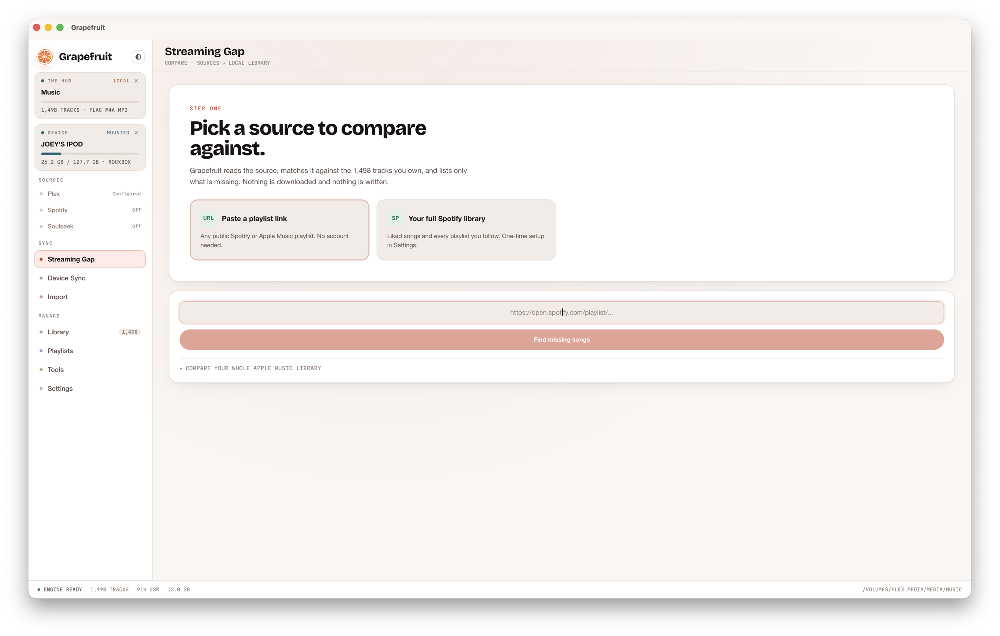
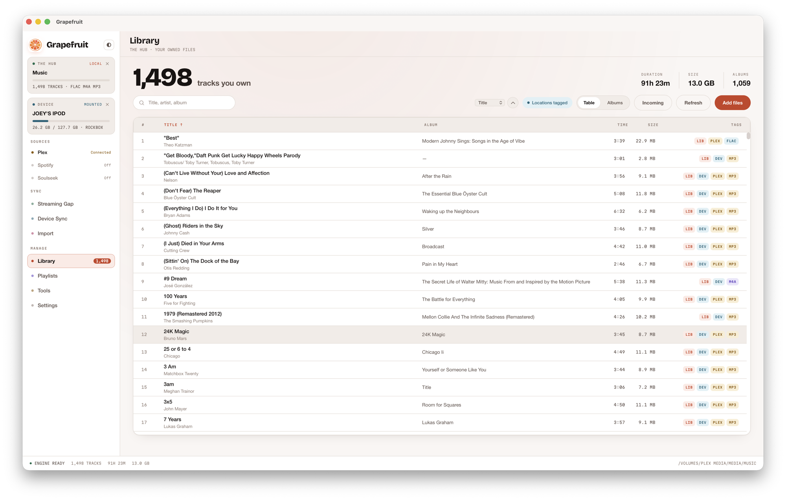
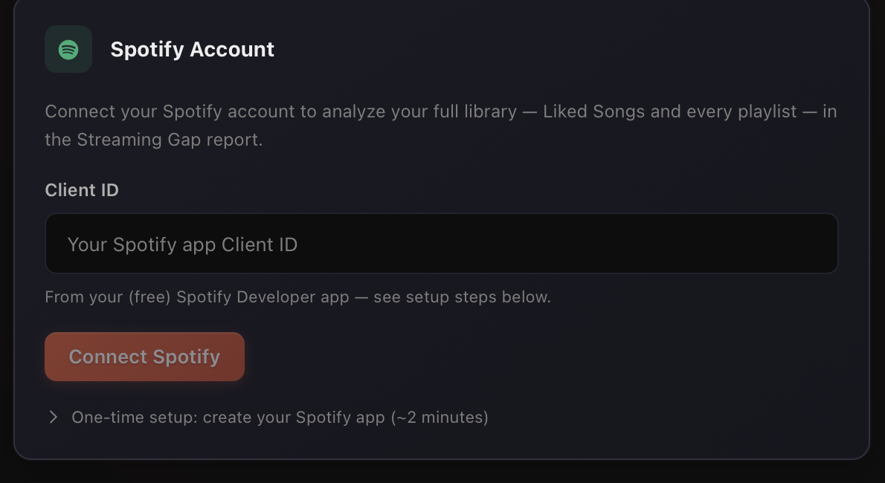

<p align="center">
  
</p>

# Grapefruit

A desktop music sync manager. Grapefruit treats the music library you own as the
source of truth and keeps everything else lined up with it — streaming services,
a Plex server, and iPod/Rockbox devices.

There are plenty of good music managers around, but not much focused on the
syncing side of things: knowing what's in your streaming accounts but missing
from your library, and pushing your library out to the places you actually
listen.

```
  Spotify / Apple Music ──┐
                          │   gap analysis: what am I missing?
  your music library ◄────┤
       (the hub)          │   one-way sync: library → devices and servers
                          ▼
          iPod / Rockbox · Plex · local folders
```

Built with Tauri (Rust) and React, with a Python engine for scraping, matching,
and syncing. Runs on macOS, Windows, and Linux.

## What it does

- **Streaming Gap** — compare a streaming source against your library and get
  the list of songs you still need to find. Works with any public Spotify or
  Apple Music playlist URL (no login), or with your full Spotify library
  (Liked Songs plus every playlist) once you connect your account. Copy the
  missing list to the clipboard or export it as CSV / plain text.
  - *Whole Apple Music library:* make a playlist of all your songs, share it
    (public link), and paste that — no account or API needed.
  - *Note:* Spotify's API now requires a **Premium** account (changed Feb 2026);
    the playlist-URL gap works on any account.
- **Device Sync** — one-way sync from your library to an iPod (Rockbox or
  Apple firmware) or any folder. Three modes: selective, full mirror, delta.
- **Import** — turn a playlist URL into a real playlist on your device: fetch,
  match against what's there, resolve uncertain matches by hand, save as M3U8.
- **Plex** — push device playlists to your Plex server, or pull Plex metadata
  (tags and artwork) onto your files, with a field-by-field diff before
  anything is written.
- **Library tools** — browse and search, edit tags and album art, find
  duplicates (trash with undo), health check, auto-organize into
  Artist/Album folders.

## Screenshots

**Streaming Gap** — point it at a streaming source and your library, and it
tells you what you're missing.



**Library** — browse and search everything you own.



**Connect Spotify** — a one-time, bring-your-own-app setup for full-library
analysis.



## Install

Download the latest installer from the
[Releases page](https://github.com/FugginBeenus/grapefruit/releases):
`.dmg` (macOS), `.exe` (Windows), `.AppImage` / `.deb` (Linux).

Grapefruit isn't code-signed/notarized yet, so the OS warns on first launch:

- **macOS — "Grapefruit is damaged and can't be opened":** it isn't damaged —
  macOS quarantines un-notarized apps. Remove the flag once, then open normally:
  ```bash
  xattr -dr com.apple.quarantine /Applications/Grapefruit.app
  ```
  (adjust the path if you installed it elsewhere).
- **Windows — "Windows protected your PC":** click **More info → Run anyway**.

## Connecting Spotify

> **Heads up:** as of February 2026 Spotify's API requires a **Premium**
> account. On a free account, library reads may be blocked — but the
> playlist-URL gap (including the Apple Music whole-library trick above) works
> on any account, no login required.

Full-library analysis uses Spotify's official API through your own free
developer app. One-time setup, about two minutes:

1. Go to [developer.spotify.com/dashboard](https://developer.spotify.com/dashboard)
   and log in with your Spotify account
2. Create an app (any name), check **Web API**
3. Set the Redirect URI to `http://127.0.0.1:8721/callback`
4. Copy the Client ID into Grapefruit → Settings → Spotify Account → Connect

Grapefruit only asks for read access (library and playlists), and tokens are
stored encrypted.

## Finding your Plex token

Settings → Plex Server has a built-in walkthrough, or see
[Plex's guide](https://support.plex.tv/articles/204059436-finding-an-authentication-token-x-plex-token/).

## Development

Requirements: Node 18+, Rust ([rustup.rs](https://rustup.rs)), Python 3.10+

```bash
git clone https://github.com/FugginBeenus/grapefruit.git
cd grapefruit
npm install
pip install -r python/requirements.txt
npm run tauri dev      # frontend + Rust shell + Python sidecar together
```

### How it's put together

```
src/            React + Tailwind UI (pages, stores, components)
src-tauri/      Rust shell — window, sidecar lifecycle, JSON-RPC bridge
python/         sidecar engine — JSON-RPC over stdio
  core/         scrapers, fuzzy matcher, sync engine, Plex & Spotify clients
```

The frontend never touches the network or filesystem directly — everything goes
through `rpcCall()` → Rust → the Python sidecar.

### Release builds

```bash
npm run tauri build
```

Pushing a `v*` tag builds installers for all three platforms via GitHub Actions
(`.github/workflows/release.yml`), with the sidecar compiled by PyInstaller.

## License

ISC
